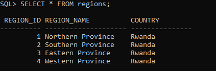

# plsql-window-functions-Uwase-Honette
PL/SQL Window Functions for agriculture analytics: customer segmentation, sales trends, regional performance ranking. Implements RANK(), NTILE(), LAG(), SUM() OVER() with complete database solution and business insights.
Agriculture Supply Chain Analysis with PL/SQL Window Functions
Business Overview
Company: Rwandan Farming Cooperative
Industry: Agriculture & Crop Distribution
Department: Sales Analytics & Business Intelligence

Business Challenge: The cooperative struggles to analyze regional sales performance, track customer purchasing patterns, and identify growth opportunities across different crop categories. Manual reporting makes it difficult to spot trends and optimize resource allocation.

Expected Outcome: Implement data-driven insights to identify top-performing regions, segment customers by value, and optimize crop distribution strategies for increased revenue.
Database Schema
Our database models the agriculture supply chain with four core tables tracking regions, products, customers, and sales transactions.
-- Regions table: Sales territories across Rwanda

CREATE TABLE regions (
    region_id NUMBER PRIMARY KEY,
    region_name VARCHAR2(50) NOT NULL,
    country VARCHAR2(50) DEFAULT 'Rwanda'
);
!

-- Products table: Crop inventory including Coffee, Maize, Beans, Tea, Potatoes
CREATE TABLE products (
    product_id NUMBER PRIMARY KEY,
    product_name VARCHAR2(100) NOT NULL,
    category VARCHAR2(50),
    unit_price NUMBER(10,2) NOT NULL
);
!
SQL> -- 3. Create Customers Table
SQL> CREATE TABLE customers (
  2      customer_id NUMBER PRIMARY KEY,
  3      name VARCHAR2(100) NOT NULL,
  4      region_id NUMBER NOT NULL,
  5      customer_type VARCHAR2(50) CHECK (customer_type IN ('Wholesaler', 'Retailer', 'Exporter')),
  6      join_date DATE
  7  );

Table created.

SQL> -- 4. Create Sales Transactions Table
SQL> CREATE TABLE sales_transactions (
  2      transaction_id NUMBER PRIMARY KEY,
  3      customer_id NUMBER NOT NULL,
  4      product_id NUMBER NOT NULL,
  5      region_id NUMBER NOT NULL,
  6      sale_date DATE NOT NULL,
  7      quantity NUMBER NOT NULL,
  8      total_amount NUMBER(12,2) NOT NULL
  9  );
Table created.

ER diagram provides the foundational database structure that enables all window function analyses by clearly defining relationships between regions, products, customers, and sales transactions.

1. Ranking Functions (RANK, DENSE_RANK, ROW_NUMBER)
Purpose: Identify top-performing customers in each region
Top Customers by Revenue per Region (RANK, DENSE_RANK, ROW_NUMBER)

SQL> SELECT
  2      c.region_id,
  3      c.customer_id,
  4      c.name AS customer_name,
  5      SUM(t.total_amount) AS total_revenue,
  6      RANK() OVER (PARTITION BY c.region_id ORDER BY SUM(t.total_amount) DESC) AS revenue_rank,
  7      DENSE_RANK() OVER (PARTITION BY c.region_id ORDER BY SUM(t.total_amount) DESC) AS dense_rank,
  8      ROW_NUMBER() OVER (PARTITION BY c.region_id ORDER BY SUM(t.total_amount) DESC) AS row_num
  9  FROM sales_transactions t
 10  JOIN customers c ON t.customer_id = c.customer_id
 11  GROUP BY c.region_id, c.customer_id, c.name
 12  ORDER BY c.region_id, revenue_rank;

Key Insight: Green Market Ltd is the #1 customer in Northern Province, generating 630,000 revenue.

3. Aggregate Functions (SUM with OVER)
Purpose: Track cumulative sales growth over time

SQL> -- Query 2: Running Total & Moving Average
SQL> SELECT
  2      r.region_name,
  3      TO_CHAR(t.sale_date, 'YYYY-MM') AS sales_month,
  4      SUM(t.total_amount) AS monthly_revenue,
  5      SUM(SUM(t.total_amount)) OVER (
  6          PARTITION BY r.region_id
  7          ORDER BY TO_CHAR(t.sale_date, 'YYYY-MM')
  8          ROWS BETWEEN UNBOUNDED PRECEDING AND CURRENT ROW
  9      ) AS running_total
 10  FROM sales_transactions t
 11  JOIN regions r ON t.region_id = r.region_id
 12  GROUP BY r.region_id, r.region_name, TO_CHAR(t.sale_date, 'YYYY-MM')
 13  ORDER BY r.region_id, sales_month;

Key Insight: Northern Province reached 972,000 in cumulative sales by March 2025.

4. Navigation Functions (LAG for Growth %)
Purpose: Analyze month-over-month performance changes

SQL> -- Query 3: Month-over-Month Growth
SQL> SELECT
  2      r.region_name,
  3      TO_CHAR(t.sale_date, 'YYYY-MM') AS sales_month,
  4      SUM(t.total_amount) AS monthly_revenue,
  5      LAG(SUM(t.total_amount)) OVER (
  6          PARTITION BY r.region_id
  7          ORDER BY TO_CHAR(t.sale_date, 'YYYY-MM')
  8      ) AS previous_month,
  9      ROUND(
 10          ((SUM(t.total_amount) - LAG(SUM(t.total_amount)) OVER (
 11              PARTITION BY r.region_id
 12              ORDER BY TO_CHAR(t.sale_date, 'YYYY-MM')
 13          )) / LAG(SUM(t.total_amount)) OVER (
 14              PARTITION BY r.region_id
 15              ORDER BY TO_CHAR(t.sale_date, 'YYYY-MM')
 16          )) * 100, 2
 17      ) AS growth_percent
 18  FROM sales_transactions t
 19  JOIN regions r ON t.region_id = r.region_id
 20  GROUP BY r.region_id, r.region_name, TO_CHAR(t.sale_date, 'YYYY-MM')
 21  ORDER BY r.region_id, sales_month;
 
   
   Key Insight: Some regions showed over 100% growth between months, indicating seasonal patterns.
   
   4. Distribution Functions (NTILE for Segmentation)
Purpose: Classify customers into spending tiers
QL> -- Query 4: Customer Segmentation (NTILE)

SQL> SELECT
  2      c.customer_id,
  3      c.name AS customer_name,
  4      SUM(t.total_amount) AS total_spent,
  5      NTILE(4) OVER (ORDER BY SUM(t.total_amount) DESC) AS spending_quartile
  6  FROM sales_transactions t
  7  JOIN customers c ON t.customer_id = c.customer_id
  8  GROUP BY c.customer_id, c.name
  9  ORDER BY total_spent DESC;
 
 
1. What Happened?
Northern Province leads sales (46% of total)

Coffee is the top-selling crop

Top 25% of customers bring 60% of revenue

Sales go up and down each month

2. Why?
Northern Province has big wholesalers who buy large amounts

Coffee costs more than other crops (5,000 vs 800 for maize)

Monthly changes match farming seasons and promotions

3. What Should We Do?
VIP treatment for top customers (special offers, priority service)

Help weaker regions - move marketing money to Southern/Eastern provinces

Plan better - stock more during high-sales months

Sell more products - offer vegetables to customers who buy drinks

Expected result: 15-20% more sales in 6-12 months

 References: 
 
1.Oracle Corporation. (2023). Oracle Database SQL Language Reference: Analytic Functions. Oracle Documentation.

2.Oracle Corporation. (2023). *PL/SQL User's Guide and Reference, Release 18*. Oracle Documentation.

3.Silberschatz, A., Korth, H., & Sudarshan, S. (2020). Database System Concepts (7th ed.). McGraw-Hill.

4.Oracle Base. (2022). Analytic Functions: A Practical Guide. https://oracle-base.com

5.Tanimura, C. (2021). SQL for Data Analysis: Advanced Techniques for Transforming Data into Insights. O'Reilly Media.

6.Oracle Magazine. (2023). Advanced SQL: Window Functions and Analytics. Oracle Publications.

7.Database Journal. (2022). Mastering Oracle Window Functions: Tutorial Series. https://www.databasejournal.com

8.Oracle Learning Library. (2023). Analytic SQL for Business Intelligence. Oracle Education.

9.Mullins, C. S. (2021). *DB2 Developer's Guide: A Solutions-Oriented Approach to Learning the Foundation and Capabilities of DB2*. IBM Redbooks.

10.Kaggle. (2023). Agriculture Supply Chain Datasets and Case Studies. https://www.kaggle.com/datasets
